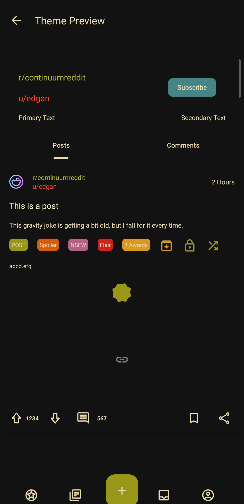
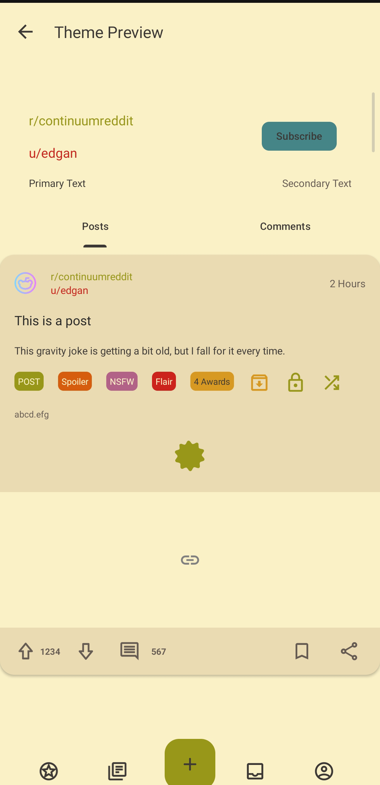

<div align="center">
  <h1>
    <span style="color:#FBF1C7; background:#121212; padding:8px 16px; border-radius:12px 0 0 12px;">Continuum Gru</span><span style="color:#3C3836; background:#FBF1C7; padding:8px 16px; border-radius:0 12px 12px 0;">vbox Themes</span>
  </h1>

  <div style="display:flex; width:100%; height:4px; margin:16px 0 24px 0;">
    <div style="width:50%; background:#121212;"></div>
    <div style="width:50%; background:#FBF1C7;"></div>
  </div>
</div>

<div style="background:#121212; border-radius:16px; padding:32px; margin:16px 0;">
<table>
<tr>
<td width="320" style="vertical-align:top; padding-right:32px;">
  
</td>
<td style="vertical-align:top; color:#EBDBB2; font-family:monospace; padding-left:16px;">

````json
{
  "name": "Gruvbox Deep Dark",
  "isDarkTheme": true,
  "backgroundColor": "#FF121212",
  "primaryTextColor": "#FFEBDBB2",
  "postTitleColor": "#FFFBF1C7",
  "linkColor": "#FFB16286",
  "upvoted": "#FFCC241D",
  "downvoted": "#FF458588",
  ...
}
````

<div align="right" style="margin-top:16px;">
  <a href="./Gruvbox_Deep_Dark.json">
    
  </a>
</div>

</td>
</tr>
</table>
</div>

<div style="display:flex; width:100%; height:4px; margin:32px 0;">
  <div style="width:50%; background:#121212;"></div>
  <div style="width:50%; background:#FBF1C7;"></div>
</div>

<div style="background:#FBF1C7; border-radius:16px; padding:32px; margin:16px 0;">
<table>
<tr>
<td width="320" style="vertical-align:top; padding-right:32px;">
  
</td>
<td style="vertical-align:top; color:#3C3836; font-family:monospace; padding-left:16px;">

````json
{
  "name": "Gruvbox Deep Light",
  "isDarkTheme": false,
  "backgroundColor": "#FFFBF1C7",
  "primaryTextColor": "#FF3C3836",
  "postTitleColor": "#FF282828",
  "linkColor": "#FFB16286",
  "upvoted": "#FFCC241D",
  "downvoted": "#FF458588",
  ...
}
````

<div align="right" style="margin-top:16px;">
  <a href="./Gruvbox_Deep_Light.json">
    
  </a>
</div>

</td>
</tr>
</table>
</div>

<div align="center" style="margin-top:24px; color:#928374;">
  <sub>☁️ Crafted with Gruvbox palette</sub>
</div>
